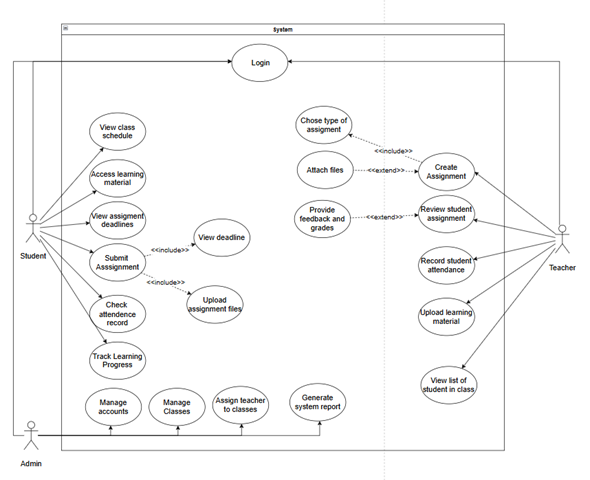

# LearnUp - English Learning Application
Một nền tảng học tiếng Anh trực tuyến hiện đại, hỗ trợ học viên rèn luyện, học tập và quản lý tiến trình học tiếng Anh một cách dễ dàng và hiệu quả.

## Thành viên & Phân công nhiệm vụ
| STT | Họ và tên              | Nhiệm vụ đảm nhận                          |
|-----|------------------------|--------------------------------------------|
| 1   | Đỗ Thanh Hải           | Trưởng nhóm, Backend Admin, Frontend Admin |
| 2   | Trần Nam Khánh         | Backend Learner, Frontend Learner          |
| 3   | Trần Lê Nam            | Frontend Learner, Backend Learner          |

## 🚀 Tính năng chính
Hệ thống cung cấp đầy đủ các tính năng cần thiết cho một nền tảng học tiếng Anh:

- **👤 Quản lý Tài khoản:** Đăng ký, đăng nhập (JWT), cập nhật thông tin cá nhân. Phân quyền rõ ràng cho Admin và Người học.
- **📚 Quản lý Bài viết & Tài liệu:** Hỗ trợ tạo, chỉnh sửa và quản lý các bài viết, tài liệu học tập.
- **📝 Quản lý Câu hỏi & Trả lời:** API tạo và quản lý câu hỏi, bài tập, cũng như theo dõi câu trả lời của học viên.
- **🔐 Bảo mật:** Xác thực người dùng an toàn bằng JWT và mã hóa mật khẩu bằng bcrypt. Hỗ trợ chức năng cấp lại mật khẩu qua email.

## 🗺 Sơ đồ Use Case
Dưới đây là sơ đồ tổng quan về các chức năng và tương tác của người dùng với hệ thống:



## 🛠 Công nghệ sử dụng
Dự án được xây dựng theo mô hình Client-Server với các công nghệ tiên tiến:

**Frontend**
- HTML5
- CSS3 / SCSS
- JavaScript

**Backend**
- Framework: FastAPI (Python)
- Database: MySQL (tương tác qua `mysql.connector`)
- Authentication: JWT & bcrypt

**Deployment**
- Frontend Hosting: Render
- Backend Hosting: Render
- Database Cloud: TiDB Cloud

## 🔗 Danh sách đường dẫn truy cập
Dưới đây là các liên kết quan trọng để truy cập vào hệ thống đã được triển khai:

| Kênh truy cập     | Đường dẫn (URL)                   | Mô tả |
|-------------------|-----------------------------------|-------|
| 🏠 Website chính | `(Cập nhật link deploy tại đây)`| Trang dành cho người học trải nghiệm. |

## 🔐 Tài khoản trải nghiệm
Sử dụng các tài khoản dưới đây để trải nghiệm đầy đủ tính năng của website:

Chú ý: Đăng nhập tại 2 cửa sổ trình duyệt khác nhau để tránh lỗi xác thực (nếu test cùng lúc).

| Vai trò        | Tên đăng nhập / Email | Mật khẩu   | Ghi chú                            |
|:---------------|:----------------------|:-----------|:-----------------------------------|
| **User1**      | `user1@gmail.com`     | `12345678` | Hoặc tạo tài khoản mới             |
| **User2**      | `user2@gmail.com`     | `12345678` | Hoặc tạo tài khoản mới             |
| **Admin**      | `admin1@gmail.com`    | `12345678` |                                    |

## 📚 Tài liệu tham khảo
- **API Documentation:** [Xem tại đây](http://localhost:8001/docs) *(Truy cập Swagger UI khi chạy Backend)*
- **Nguồn mã nguồn:** [GitHub - dothanhhxx/LearnUp](https://github.com/dothanhhxx/LearnUp)

---

## ⚙️ Hướng dẫn Cài đặt & Chạy Local

**1. Yêu cầu (Prerequisites)**
- Python (v3.10 trở lên)
- MySQL Server (đang chạy)

**2. Cài đặt**
```bash
# Clone dự án
git clone https://github.com/dothanhhxx/LearnUp.git
cd LearnUp

# Cài Backend Dependencies
cd backend
pip install -r requirements.txt
```

**3. Khởi tạo Database**
- Mở MySQL Workbench, phpMyAdmin hoặc Command Line.
- Import file `backend/database.sql` để tạo tự động DB `learnup` và các bảng.
- Tạo file `.env` tại thư mục `backend/` theo mẫu:
```env
PORT=5000
DB_HOST=127.0.0.1
DB_PORT=3306
DB_USER=root
DB_PASSWORD=
DB_NAME=LearnUp
```
*(Chỉnh sửa `DB_PORT` và `DB_PASSWORD` tương ứng).*

**4. Khởi chạy Server**
Mở 2 Terminal riêng biệt:

- **Terminal 1 - Backend:**
  ```bash
  cd backend
  python seed_data.py  # Sinh dữ liệu mẫu
  python main.py
  ```
  Backend chạy tại `http://localhost:8001`

- **Terminal 2 - Frontend:**
  - Sử dụng **Live Server** (trên VS Code) để mở file `index.html`.
  - Giao diện chạy tại `http://localhost:5500`
